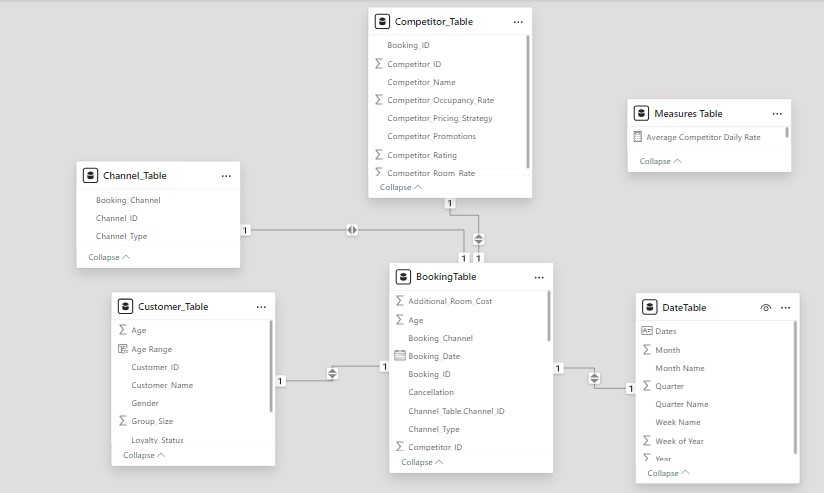
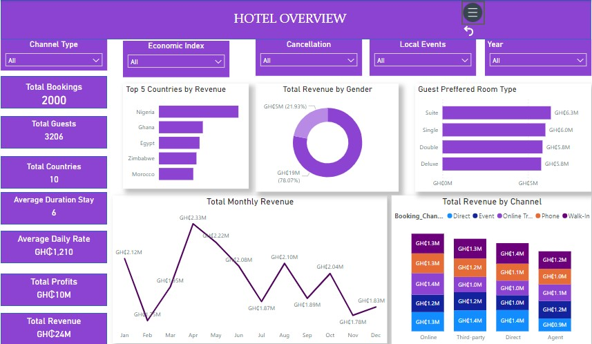
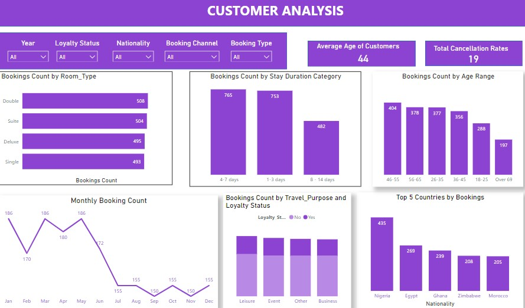
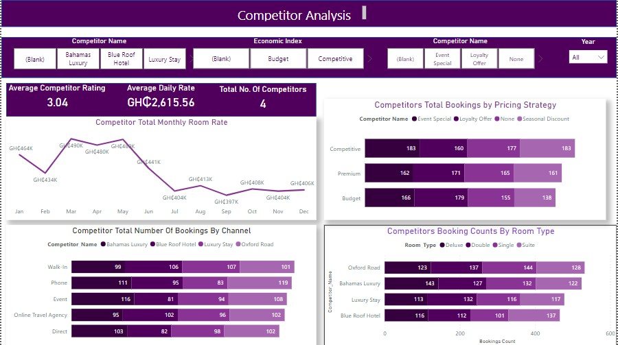

# Predictive Hotel Booking Patterns


## Introduction

This Power BI project aims to analyze the hotel booking data for the fictional company “Hospitality Haven.” By deriving insights from the data, we aim to answer crucial questions and provide actionable recommendations to help the business make informed decisions.

**_Disclaimer_**: _The data used in this analysis is purely fictional and created for educational purposes. Any resemblance to real individuals, companies, or events is coincidental. The dataset does not represent any actual business or organization, and the insights derived from it should be treated as hypothetical._

## Business Overview and Challenges: Optimizing Hotel Operations

### The Prevailing Challenge:
Hospitality Haven, a prominent hotel chain, grapples with efficiently managing their hotel bookings, pricing strategies, and occupancy rates. The competitive travel and tourism industry adds complexity, influenced by seasonal trends, market fluctuations, and evolving guest preferences. Here are the specific obstacles they face:

1. **Seasonal Variations:**
   - Occupancy rates fluctuate significantly due to seasonal tourism patterns.
   - Accurate prediction is elusive, leading to overbooking or underutilization of properties.

2. **Pricing Dilemma:**
   - Striking the right balance between revenue maximization and guest affordability is challenging.
   - Setting optimal room prices requires precision.

3. **Understanding Customer Behavior:**
   - Insights into booking lead times, preferred channels, and the impact of promotions are lacking.
   - Understanding guest behavior drives better decision-making.

4. **Demand Forecasting:**
   - Accurate predictions are vital for resource allocation and staffing.
   - Misjudgments result in operational inefficiencies and affect guest satisfaction.

5. **Competitive Intelligence:**
   - Staying competitive demands real-time awareness of market dynamics.
   - Insights into competitor pricing strategies and booking trends are essential.

#### Hospitality Haven's success lies in overcoming these challenges through data-driven strategies and adaptive decision-making.
---

## Rationale for the Project: Optimizing Hotel Operations

1. **Enhanced Customer Experience:**
   - Analyzing guest behavior data allows us to personalize services.
   - Higher guest satisfaction and repeat bookings result.

2. **Revenue Optimization:**
   - Predictive analysis fine-tunes room pricing strategies.
   - Maximizes revenue while staying competitive.

3. **Operational Efficiency:**
   - Accurate demand forecasting optimizes resource allocation.
   - Reduces operational costs and improves staff efficiency.

4. **Competitive Advantage:**
   - Insights into competitor strategies inform our responses.
   - Keeps Hospitality Haven ahead in the industry.

5. **Data-Driven Decisions:**
   - Gut feelings are replaced by data-backed choices.
   - Elevates hotel management effectiveness.

## Project Goals:

1. **Comprehensive Data Insights:**
   - Dive deep into historical booking data.
   - Uncover hidden patterns and trends.
   - Understand guest behavior and preferences.

2. **Customer Behavior Analysis:**
   - Explore booking lead times.
   - Identify preferred booking channels.
   - Evaluate the impact of promotions and discounts.

3. **Booking Pattern Identification:**
   - Visualize seasonal trends.
   - Proactively allocate resources based on booking patterns.

4. **Pricing Strategy Assessment:**
   - Analyze historical pricing data.
   - Optimize room rates for revenue and competitiveness.

5. **Competitor Benchmarking:**
   - Compare competitor pricing strategies.
   - Stay ahead in the dynamic hospitality industry.

## Project Scope: A Step-by-Step Journey

1. **Data Collection and Integration:**
   - Gathered historical data on bookings, customer profiles, and competitor pricing.
   - Cleaned and transformed the data into a unified dataset.

2. **Exploratory Data Analysis (EDA):**
   - Uncovered insights through data visualization.
   - Explored distributions, correlations, and trends.

3. **Competitor Analysis:**
   - Analyzed competitors' pricing strategies and booking trends.
   - Positioned Hospitality Haven strategically.

4. **Power BI Dashboards: Real-Time Insights:**
   - Leveraged Power BI to create interactive dashboards.
   - Monitored occupancy rates, pricing, and guest behavior.

## Data Description

The data resides within a Microsoft Excel workbook. To import it into Power BI, follow these steps:

1. **Launch Power BI:**
   - Open Power BI Desktop.

2. **Get Data:**
   - Click on "Get Data" from the home tab.

3. **Select Excel Workbook:**
   - Choose the Excel workbook containing your data.

4. **Confirm Structure:**
   - Use Power Query to verify and shape the data structure.

## Data Model

---
## Dax Formulas and Measures Created

1. **Average Competitor Daily Rate**:
   ```dax
   Average Competitor Daily Rate = CALCULATE(AVERAGE(BookingTable[Competitor_Room_Rate]))
   ```
   This measure calculates the average daily room rate of competitors from the `BookingTable`.

2. **Average Competitor Rating**:
   ```dax
   Average Competitor Rating = AVERAGE(Competitor_Table[Competitor_Rating])
   ```
   This measure calculates the average rating of competitors from the `Competitor_Table`.

3. **Average Stay**:
   ```dax
   Average Stay = AVERAGE(BookingTable[Duration_of_Stay])
   ```
   This measure calculates the average duration of stay from the `BookingTable`.

4. **AVG Daily Rate**:
   ```dax
   AVG Daily _Rate = AVERAGE(BookingTable[Room_Rate])
   ```
   This measure calculates the average daily room rate from the `BookingTable`.

5. **Bookings Count**:
   ```dax
   Bookings Count = COUNTROWS(BookingTable)
   ```
   This measure counts the total number of bookings in the `BookingTable`.

6. **Cancellation Rate**:
   ```dax
   Cancellation Rate = DIVIDE(
       COUNTAX(FILTER(BookingTable, BookingTable[Cancellation] = "Yes"), BookingTable[Cancellation]),
       COUNT(BookingTable[Booking_ID]), 
       0
   ) * 100
   ```
   This measure calculates the cancellation rate as a percentage. It counts the number of bookings where the cancellation status is "Yes" and divides it by the total number of bookings, then multiplies by 100 to get the percentage.

7. **Total Competitor Rate**:
   ```dax
   Total Competitor Rate = SUM(Competitor_Table[Competitor_Room_Rate])
   ```
   This measure calculates the total room rates of all competitors from the `Competitor_Table`.

8. **Total Competitors**:
   ```dax
   Total Competitors = DISTINCTCOUNT(Competitor_Table[Competitor_ID])
   ```
   This measure counts the total number of unique competitors in the `Competitor_Table`.

9. **Total Guests**:
   ```dax
   Total Guests = CALCULATE(SUM(Customer_Table[Group_Size]), 'BookingTable'[Cancellation] = "No")
   ```
   This measure calculates the total number of guests from the `Customer_Table` for bookings that were not canceled.

10. **Total Loss**:
    ```dax
    Total Loss = CALCULATE(
        SUMX(
            'BookingTable', 
            ('BookingTable'[Room_Rate] * 'BookingTable'[Duration_of_Stay]) - BookingTable[Additional_Room_Cost]
        ), 
        BookingTable[Room_Rate] * BookingTable[Duration_of_Stay] < BookingTable[Additional_Room_Cost]
    )
    ```
    This measure calculates the total loss by summing the difference between the room rate multiplied by the duration of stay and the additional room cost for each booking where the total room rate is less than the additional room cost.

11. **Total Profit**:
    ```dax
    Total Profit = CALCULATE(
        SUMX(
            BookingTable, 
            (BookingTable[Room_Rate] * BookingTable[Duration_of_Stay]) - 'BookingTable'[Additional_Room_Cost]
        ), 
        BookingTable[Cancellation] = "No"
    )
    ```
    This measure calculates the total profit by summing the difference between the room rate multiplied by the duration of stay and the additional room cost for each booking that was not canceled.

12. **Total Revenue**:
    ```dax
    Total Revenue = CALCULATE(
        SUMX(
            BookingTable, 
            BookingTable[Competitor_Room_Rate] * BookingTable[Duration_of_Stay]
        ), 
        BookingTable[Cancellation] = "No"
    )
    ```
    This measure calculates the total revenue by summing the competitor's room rate multiplied by the duration of stay for each booking that was not canceled.

## Visualization
The report contains 3 pages
1. Overview
2. Customer Analysis
3. Competitor Analysis



The "Hotel Overview" dashboard provides a comprehensive analysis of the hotel's key performance indicators, showcasing crucial insights into booking trends, revenue distribution, and guest demographics. 

Notably, the hotel generated significant revenue, with a total of GHC24 million, driven predominantly by male guests (78.07% of the revenue). 

Nigeria emerged as the top country by revenue, highlighting the importance of this market. 

The average daily rate stands at GHC1,210, contributing to a total profit of GHC10 million. Preferred room types are evenly distributed, with suites and single rooms being the most popular. 

Monthly revenue trends reveal peaks in March and a consistent performance throughout the year. Additionally, the analysis by booking channels underscores the importance of a diverse booking strategy, with direct, event, and online channels each contributing GHC1.3 million. 

These insights enable hotel management to optimize operations, target key markets, and enhance profitability.

---


The "Customer Analysis" dashboard provides a detailed examination of customer behavior and demographics, offering valuable insights for hotel management. 

It reveals that the average age of customers is 44, with a total cancellation rate of 19%. 

Room type preferences show a balanced distribution, with double rooms slightly leading at 508 bookings. 

Most stays range between 4-7 days (765 bookings) and 1-3 days (753 bookings). 

Age-wise, customers aged 46-55 make up the largest segment (404 bookings). 

Monthly booking trends highlight peaks in March and May, followed by a decline during the summer months. 

When analyzed by travel purpose and loyalty status, business and leisure trips are equally popular, with loyalty members constituting a significant portion of the bookings. 

Nigeria stands out as the top country by bookings (435), followed by Egypt and Ghana. 

These insights help the hotel tailor its services, marketing strategies, and loyalty programs to better meet customer needs and preferences.

---


The "Competitor Analysis" dashboard offers a comprehensive comparison of the hotel's performance against its competitors, focusing on key metrics such as ratings, pricing strategies, and booking channels. 

It reveals that the average competitor rating is 3.04, with an average daily rate of GHC2,615.56 across four competitors. 

Monthly room rates show fluctuations, peaking in February at GHC490K and reaching a low in October at GHC397K. 

Competitor bookings by channel highlight that direct bookings are predominant, with Blue Roof Hotel leading indirect (82), walk-in (106), and event bookings (91). 

Analysis by pricing strategy indicates that competitors employ various strategies, with competitive pricing attracting the highest bookings (183), followed by premium and budget options. 

Booking counts by room type show a preference for double rooms across all competitors, with Bahamas Luxury having the highest count (143) for double rooms. 

These insights enable the hotel to strategize effectively, optimizing pricing and marketing efforts to stay competitive in the market.


